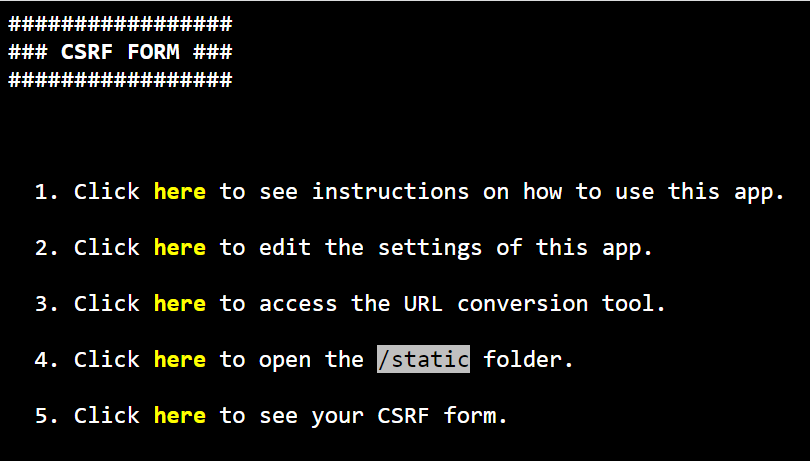
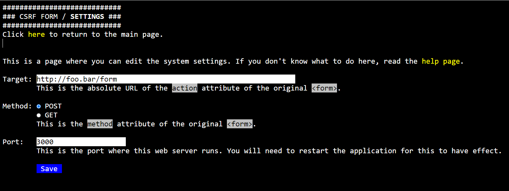

# CSRF Form

A simple web app in node.js to test the CORS configuration of other web apps.

> ⚠️ This app is meant to be used for testing purposes only. It will allow you to perform CSRF on sites that have the wrong CORS configuration. Use it with caution!

## How to use

First and foremost, you should have [node.js](https://nodejs.org/en) installed.

Then you must install all dependencies of this app. For that purpose, issue the following command:

```
npm install
```

After this is done, you may launch the application by running:

```
npm start
```

The application runs on port `3000` by default.



The system settings are stored in the `settings.json` file. It can be edited from the web app, or you can edit the file by hand. If you edit the file by hand, you need to restart the server in order for your changes to have effect.



In a nutshell, this application allows you to create a form that does CSRF. Your form must be placed in the `static` folder, and it will be available in the `/site` path within the running server. The application logs every value submitted through the form in the `logs` folder, and then performs a POST or GET (according to the settings) to the target URL.

For more detailed instruction, please refer to the **help** page of the application.

## License

This software has been released under the terms of the [MIT license](LICENSE.md).
